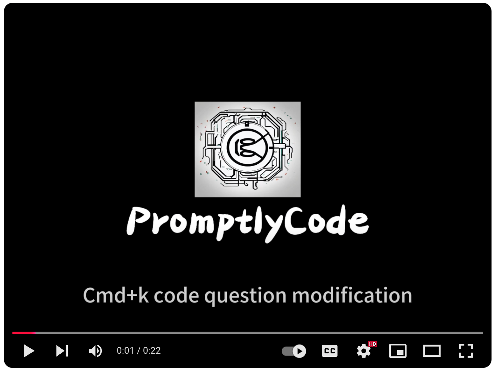
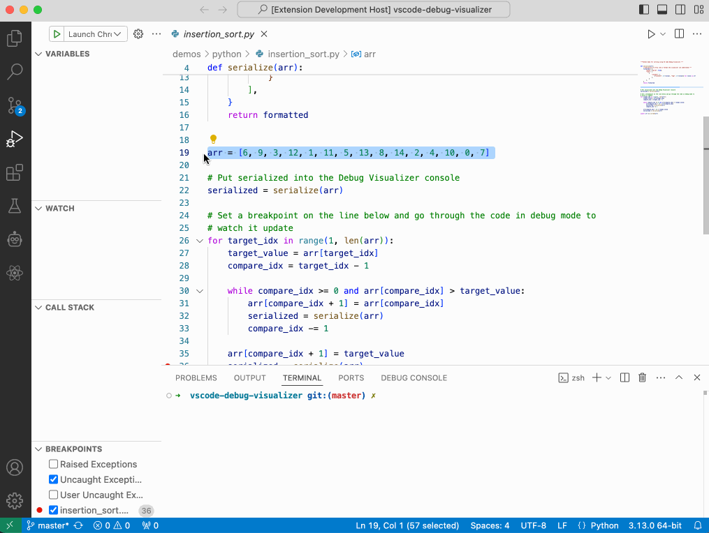
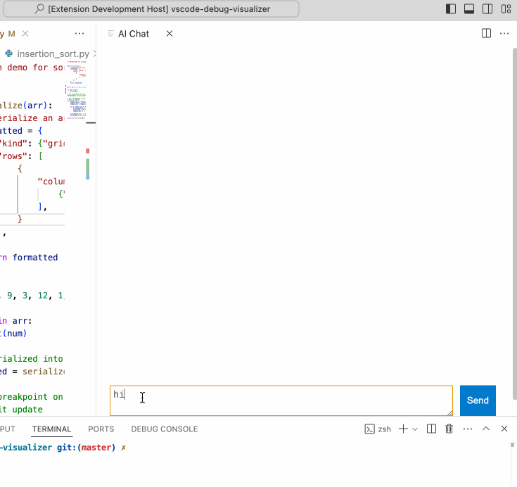

# [Promptly Code](http://www.promptlycode.com)
* Promptly Code, AI automatic programming vscode extension, Inspired by [cursor](https://www.cursor.com/)

[](https://youtu.be/KdTh2FbjVyo)

## Features

* For more information, please visit http://www.promptlycode.com

- [x] Cmd+k code question modification
- [x] Cmd+l chat for code
- [x] Chat markdown render, code highlight
- [ ] Chat question project, chat to achieve code search question
- [ ] Tab automatically complete code and predict code
- [ ] Multi-agent technology encapsulates a Docker automatic environment verification,and uses ReAct for environment feedback and error correction
- [ ] Support voice wake-up interactive programming
- [ ] Support rapid prototyping verification POC AI programming

## Usage

* `cmd+k` for code question



* `cmd+l` chat for code



## Develop

```sh
cd PromptlyCode && yarn
vscode PromptlyCode
```

* 1. Inside the editor, open `src/extension.ts` and press `F5` or run the command `Debug: Start Debugging from the Command Palette` (⇧⌘P). This will compile and run the extension in a new `Extension Development Host window`.

* 2. select some code and then press `cmd+k`

